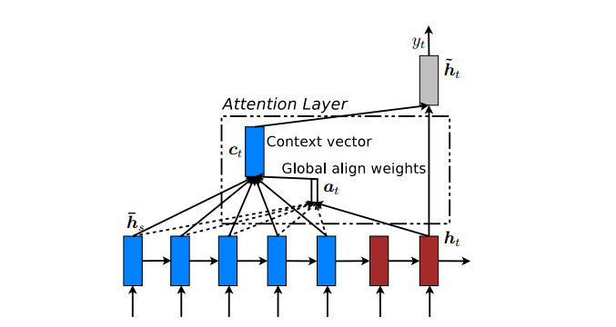

## Possible Implementation of Attention Mechanism for English to Bangla Translation
MD Muhaimin Rahman
contact: sezan92[at]gmail[dot]com

In this project I have implemented -at least tried to implement- Attention Mechanism for Encoder-Decoder Deep Learning Network for English To Bangla Translation in keras. Neural Machine Translation is a case for Encoder Decoder network. An example is given in Jason Brownlee's [blog](https://machinelearningmastery.com/develop-neural-machine-translation-system-keras/) . But this architecture had a problem for long sentences . Bahdanau et al. used Attention mechanism for Neural Machine Translation , in this [paper](https://arxiv.org/abs/1409.0473). 

### Attention Mechanism
I have used one of the implementations from Luong Thang's phd [thesis](https://github.com/lmthang/thesis). The images is as following . Don't be afraid by the image! 
What attention layer does can be summarized in following points

* Takes Input 
* Takes the Hidden state of Encode Input, 
* Takes the Hidden state of Previous Output 
* Derives a function with the two hidden state, 
* Derives a softmax function from that tanh function 
* Multiplies this softmax function with the hidden state of input 
* The attention work is done , the rest is like Decoder Architecture

### Experiment
I have worked on English to Bengali (My mother tongue). I have used the data from this [website](http://www.manythings.org/anki/) , it has around 4500 data for English-Bangla translation . The result is not good, but for my first try with attention from scratch, I am happy with it! The [notebook](Attention Mechanism.ipynb) tries to explain the code. [Bangla](Attention_bangla.png) .

* ```main_bengali_fh.py``` code for training model
* ```attention_test_fh.py``` code for testing the model

### Hardware
This architecture wasn't possible to train in my tiny laptop gpu of Geforce 920mx! Just look at the [architecture](model_schem.png) I had to use floydhub cloud gpu which is NVIDIA Tesla K80.

## Other Keras Implementations?

Not Many keras implementations are available in internet . I have found one from a brother Philip peremy , but I am doubtful about his implementation.

### Philip Peremy
Philip Peremy tried to show keras Attention [here](https://github.com/philipperemy/keras-attention-mechanism). But his code looks problematic. His schematic is as follows,  . The problem with this implementation is that it doesn't take account to the hidden state of the decoder network! It just does it's thing from the encoder side! That's a kind of manual lstm! 

### Area of Improvement
* My code is just in beta stage. I am not too much sure if My code is the perfect implementation of Attention Mechanism . So I request to the reader if any bugs or problems can be found, if yes-which is more likely-please feel free to contact!

* And obviously, the translation is not upto standard! Please try to add the data and make more human-like.
#### Acknowledgement
I first came to know about Attention mechanism from Andrew Ng's video of Deep Learning Specialization , course 5. But I was not sure how to implement them. Then I read the two above mentioned papers. Also Jason Brownlee's [article](https://machinelearningmastery.com/encoder-decoder-attention-sequence-to-sequence-prediction-keras/) helped me to make sure what I have understood is correct or not.

I am grateful to Luong Thang and Bahdanau for their papers! I found Bahdanau's paper more readable than Luong's! Both helped me a lot. 


